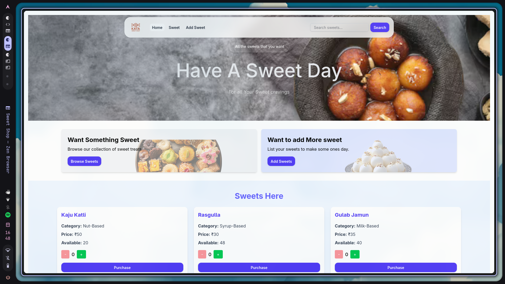
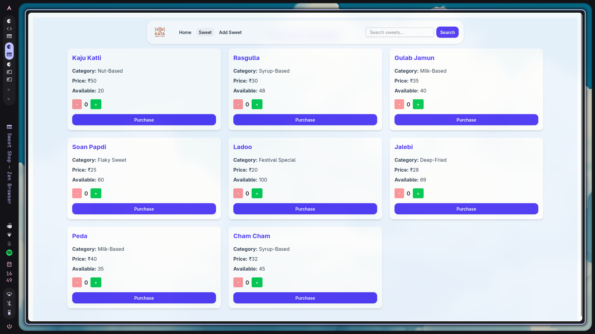
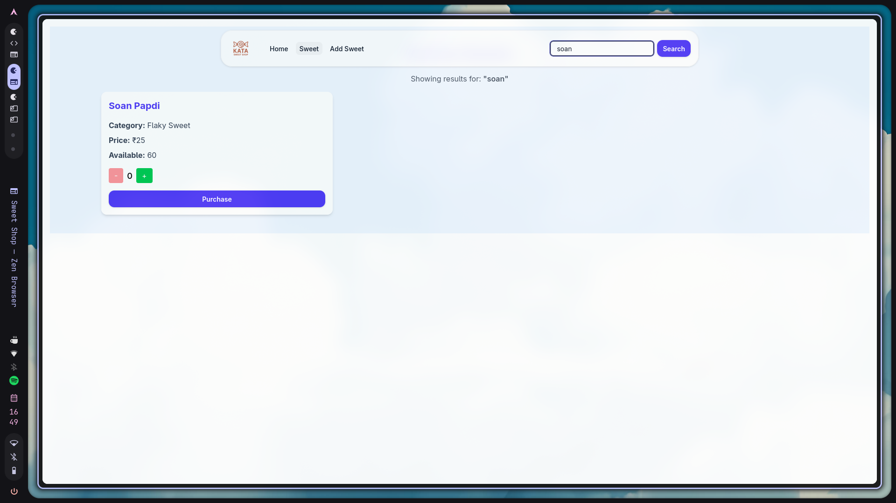
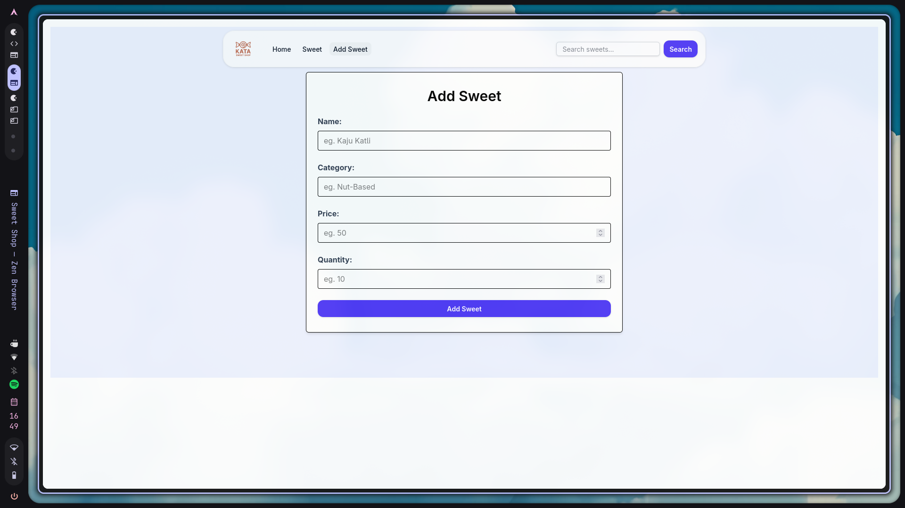

# Sweet Shop Management System

## 📦 Project Overview
**Project Name:** Sweet Shop Management System  
**Tech Stack:** React + Vite + Tailwind CSS + Jest + React Testing Library  
**Author:** Aman Patel  
**Date:** July 2025  

## 🎯 Objective
Build a simple, clean, and testable web-based system to manage a sweet shop's inventory. The system allows users to:
- View a list of sweet items
- Add new sweets to the inventory
- Search for sweets by name, category, or price
- Interact with a user-friendly, responsive UI
- Ensure core components are tested with Jest and RTL

## ✨ Features Implemented
- ✅ **Add New Sweets** - Create sweets with name, category, price, and quantity
- ✅ **View All Sweets** - Display comprehensive list of available sweets
- ✅ **Search Functionality** - Search by name, category, and price range
- ✅ **Responsive Design** - Mobile-friendly interface with Tailwind CSS
- ✅ **Form Validation** - Proper input validation for sweet creation
- ✅ **Interactive UI** - Clean, modern user interface
- ✅ **Component Testing** - Comprehensive test coverage

## 🧩 Key Components
- **Navbar.jsx** - Navigation bar with links and search functionality
- **SweetCard.jsx** - Display individual sweet details and interactions
- **AddSweet.jsx** - Form for adding new sweets with validation
- **App.jsx** - Main routing and application structure
- **tests/** - Test files for each major component

## 🛠️ Setup Instructions

### 📦 Dependencies Used
- **Vite** – Fast and modern frontend build tool
- **React (JavaScript)** – UI library for building user interfaces
- **Tailwind CSS** – Utility-first CSS framework for responsive styling
- **React Router DOM** – For client-side routing and navigation
- **JSON Server** – For simulating a REST API (mock backend)
- **Jest & React Testing Library** – For writing and running component tests

### 📁 Installation Steps

1. **Clone the Repository**
   ```bash
   git clone https://github.com/Aman241104/kata_sweet_shop.git
   cd kata_sweet_shop
   ```

2. **Install Node Modules**
   ```bash
   npm install
   ```

3. **Start the JSON Server (Mock API)**
   In a separate terminal:
   ```bash
   npm run server
   ```

4. **Run the React App**
   ```bash
   npm run dev
   ```

5. **Access the Application**
   Open your browser and navigate to:
   ```
   http://localhost:5173
   ```

## 🧪 Testing

### 🧾 Running Tests
```bash
# Run all tests
npm test

# Run tests in watch mode (for development)
npm run test:watch

# Run tests with coverage report
npm run test:coverage
```

### 📊 Test Report
```
Test Suites: 3 passed, 3 total
Tests:       7 passed, 7 total
Snapshots:   0 total
Time:        1.346 s
Status:      ✅ All tests passing
```

### 📌 Test Coverage
Our test suite covers the following components:
- **Navbar.test.js** – Navigation and search functionality
- **SweetCard.test.js** – Sweet item display and interactions
- **AddSweet.test.js** – Form validation and sweet creation

### 🗂️ Test Structure
```
src/test/
├── Navbar.test.js      # Navigation component tests
├── SweetCard.test.js   # Sweet card component tests
└── AddSweet.test.js    # Add sweet form tests
```

### 🧪 Testing Frameworks Used
- **Jest** – JavaScript testing framework
- **React Testing Library (RTL)** – React component testing utilities
- **@testing-library/jest-dom** – Custom Jest matchers for DOM elements

### ✅ Test Results Summary
- ✅ **3/3 test suites passed**
- ✅ **7/7 individual tests passed**
- ✅ **No failing tests**
- ✅ **Fast execution time (1.346s)**

## 🚀 Usage Examples

### Adding a New Sweet
1. Navigate to the "Add Sweet" page
2. Fill in the required fields:
   - Sweet name
   - Category (e.g., chocolate, candy, pastry)
   - Price
   - Quantity in stock
3. Click "Add Sweet" to save

### Searching for Sweets
- Use the search bar in the navigation to find sweets by name
- Filter results by category
- Search within specific price ranges

### Viewing Sweet Details
- Browse the main listing page to see all available sweets
- Each sweet card displays name, category, price, and stock quantity
- Clean, responsive design works on all devices

## 🏗️ Development Approach
This project was built following modern React development practices:
- **Component-based architecture** for maintainable code
- **Test-driven development** with Jest and React Testing Library
- **Responsive design** using Tailwind CSS utilities
- **Clean code principles** with proper separation of concerns

## 📁 Project Structure
```
sweet-shop/
├── src/
│   ├── components/
│   │   ├── Navbar.jsx
│   │   ├── SweetCard.jsx
│   │   └── AddSweet.jsx
│   ├── test/
│   │   ├── Navbar.test.js
│   │   ├── SweetCard.test.js
│   │   └── AddSweet.test.js
│   ├── App.jsx
│   └── main.jsx
├── public/
├── db.json
├── package.json
└── README.md
```

## 🖼️ Project Screenshots





## 🔧 Technical Details

### API Endpoints (JSON Server)
- `GET /sweets` - Retrieve all sweets
- `POST /sweets` - Add new sweet
- `PUT /sweets/:id` - Update sweet
- `DELETE /sweets/:id` - Delete sweet

### Browser Support
- Chrome (latest)
- Firefox (latest)
- Safari (latest)
- Edge (latest)

## 📝 Notes
- The application uses JSON Server for mock backend functionality
- All tests are passing with good coverage of core components
- Responsive design ensures compatibility across devices
- Clean, maintainable code following React best practices

## 🤝 Contributing
1. Fork the repository
2. Create a feature branch
3. Make your changes
4. Add tests for new functionality
5. Ensure all tests pass
6. Submit a pull request

## 📄 License
This project is created for educational purposes as part of a coding kata.

---
*Built by by Aman Patel*